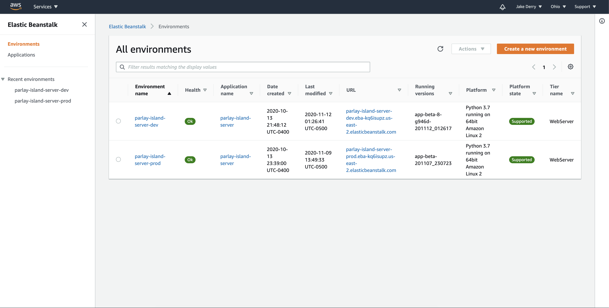

# App Maintenance

## Architecture

The Parlay Island architecture is broken into 3 components: a backend API, a Unity game, and a teacher platform. 

All components necessary for the running of our application are stored in Amazon Web Services \(AWS\).


For more information about our AWS architecture, take a look at [this LucidCharts diagram](https://lucid.app/invitations/accept/60538ef2-a428-482d-bd7d-53875b9f9c87).


### Maintenance tasks

AWS services are sometimes difficult to interact with and non-intuitive, so here are some instructions for tasks that you can do in the AWS account.

#### Log in to AWS Management Console 

All maintenance tasks require that you perform this task before doing any other task.

1. Visit [https://aws.amazon.com/console/](https://aws.amazon.com/console/).
2. Click 'log back in'
3. If you have the root user account, use that login method, but most people will have an IAM account. This just means that you don't own the account that pays for everything. 
4. If you reach a screen that says 'AWS Management Console', you have successfully logged in!

#### Shut down the stage applications

When a development team is building a product, it is helpful to have a stage deployment of the application, but when a development team is not working with the application, it is dead cost to you

1. [Log in to AWS Console](./#log-in).
2. Use the search bar in the AWS Management Console to find 'Elastic Beanstalk'. You should see a screen that looks like the one below once you have clicked on 'Elastic Beanstalk'.
3. Delete the backend API stage
   1. Check that you are in the Ohio region in the top right corner of the screen.
   2. Now, select 'parlay-island-server-dev'. Choose the 'Terminate Environment' Action.
4. Delete the teacher platform stage 
   1. Select the Virginia region which you can verify by checking in the top right corner of the screen.
   2. Select 'parlay-island-frontend-dev'. Choose the 'Terminate Environment' Action.
5. Delete the game stage
   1. Click on 'Services' in the top left corner and navigate to the 'S3' service. This service will be under the 'Storage' header.
   2. Select 'parlay-island-game-stage'. Click 'Empty'. Follow instructions to empty.
   3. Select 'parlay-island-game-stage' again. Click 'Delete'. Follow instructions to delete. 

After you have followed these steps, you have successfully stopped all stage applications!


After these actions are taken, the database instance in RDS still contains the stage data. To delete the stage database, take a look at [these instructions](./#deleting-a-database-in-the-database-instance).


####  Auto-scale one of the Elastic Beanstalk applications

When people are using your application a lot, you may want to auto-scale because as it gets bigger, you want your application to 'grow' to accommodate that growth. In Elastic Beanstalk, this requires very few setting changes and no code required!

1. [Log in to AWS Console](./#log-in).
2. Navigate to Elastic Beanstalk and click the link to open the Environment that you would like to add an ELB for.
3. Open 'Configuration', edit the 'Capacity', and change the 'Environment Type' variable from 'Single Instance' to 'Load Balanced'.


Auto-scaling requires using an Elastic Load Balancer which incurs costs. Sometimes, it might be most cost-effective to change the Instance Type.


#### Log in to the database

1. If not done already, download PostgreSQL following [this link](https://www.postgresql.org/download/). Navigate to your operating system and click 'Download the Installer'. Follow the installer instructions.
2. Open a terminal or command prompt depending on whether you use Mac/Linux or PC.
3. After filling in all of these variables, run the following command: `psql -U {username} -h {database_url} -p {port} {database_name}`
4. Provide the password.
5. You will see `postgres=>` which means that you have successfully connected to the database instance.

#### Deleting a database in the database instance

While majority of management tasks do not require working with any code, this task will require the use of a terminal or command prompt.

1. [Log in to the database](./#log-in-to-the-database).
2. Now, use the `DROP DATABASE {database}` command where you turn `{database}` into the name of the database that you wish to delete. For stage, the database name is `stage_db` . 


Deleting a database will remove all of its data and the data will NOT be recoverable. If you would like to save the data, either migrate the data by pulling from the database and adding to another one or create a backup of the database instance.


#### Observe costs

1. [Log in to AWS Console](./#log-in).
2. Navigate to the [Billing service](https://console.aws.amazon.com/billing/home?region=us-east-2#/).
3. Read the Month-to-Date Spend by Service to figure out what services are costing you money.

#### Reset the database auto-sequence

1. Set up the Parlay island backend code locally.
2. Run `pipenv run python3 manage.py sqlsequencereset teacher` in the base directory.
3. [Log in to the database](./#log-in-to-the-database).
4. Copy the output of step 2 into the database shell.

